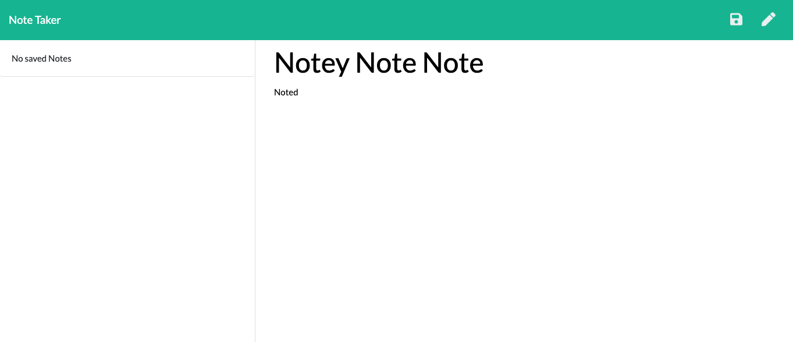

 🗒 

_A simple note taking app. Designed for easy use to enter a new note with a title; save and delete notes._

[HerokuDeployedLink](https://boiling-river-39644.herokuapp.com/)

## Requirements:
 - Node JS
 - Node Express

 ## How to run app:
 Run npm i to install dependencies.
 Run node app.js in your terminal to run the app.
 Enter http://localhost:3000/ into your browser.

